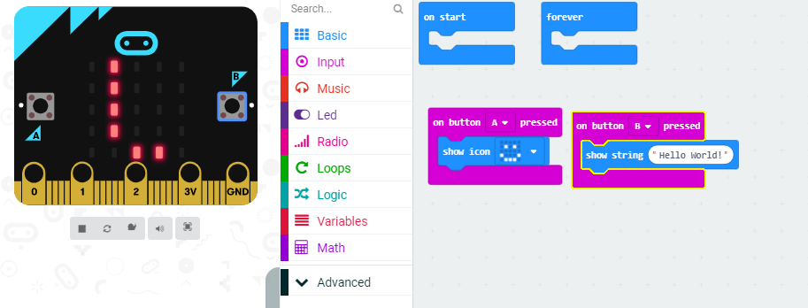
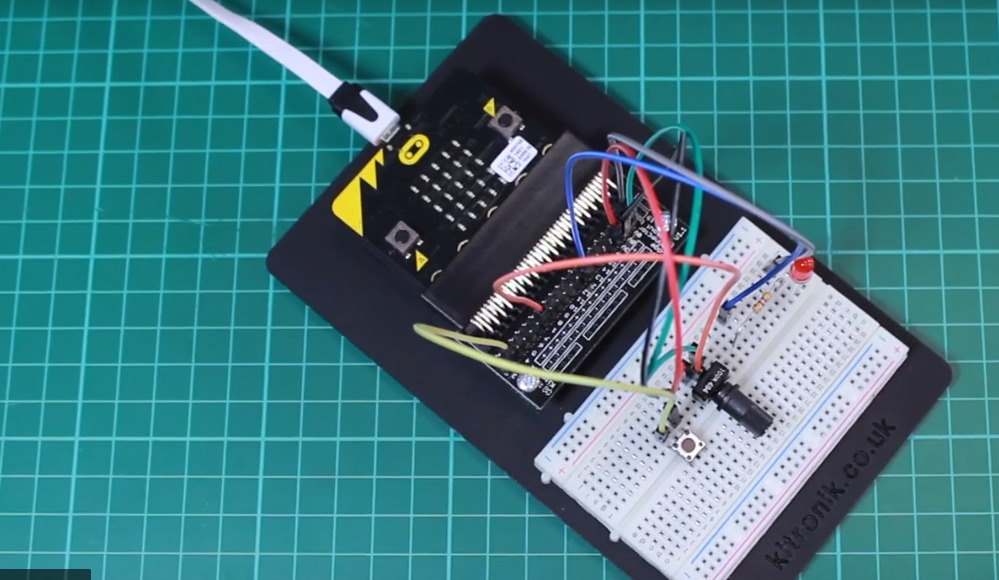
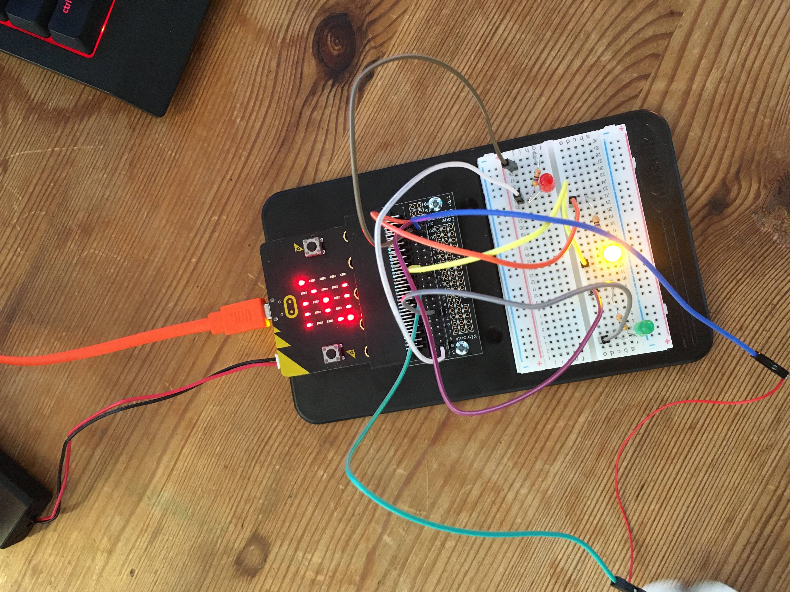
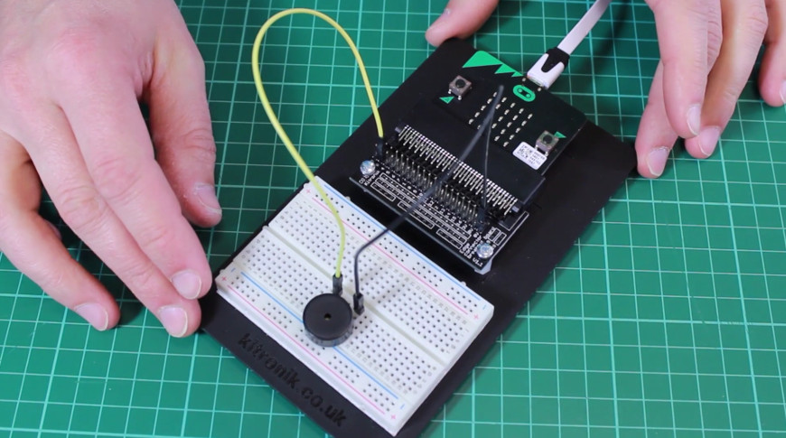
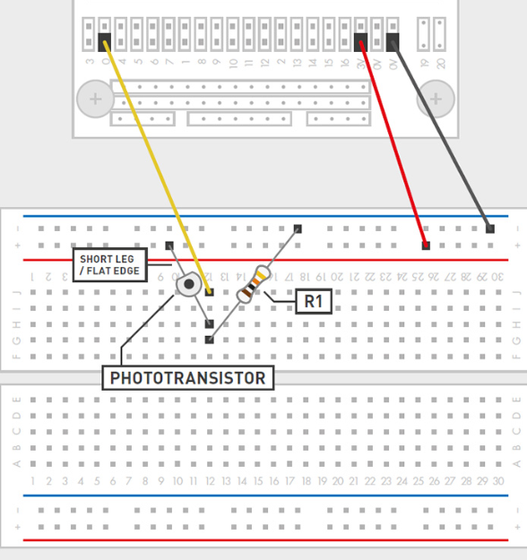
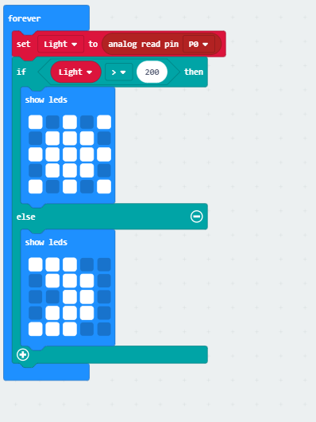

# Inventor Kit Experiments

### Say Hello to the BBC microbit ###

#### Photo of completed project ####

(Code for this project)

#### Reflection ####

In this experiment, something new to me was or something I learned was how to connect the micro bit, getting used to pairing and understanding what the blocks are and how they work.

This experiment could be the basis of a real world application such as, essentially everything. This is the basis of the micro bit.

### Dimming an LED using a Potentiometer ###

#### Photo of completed project ####

(Image from Kitronik - but mine was essentially the exact same. Done in Davids class)

#### Reflection ####

In this experiment, something new to me was or something I learned was how the breadboard works, and how and why resistors need to be used when lights are a part of the circuit.

This experiment could be the basis of a real world application such as dimmable light switches.

### Using a Transistor to Drive a Motor ###

#### Photo of completed project ####

(An extension of this project, however the same code/ principles apply.)

#### Reflection ####

In this experiment, something new to me was or something I learned was how to use and power a motor.

This experiment could be the basis of a real world application such as tabletop fans.

### Setting The Tone With A Piezzo Buzzer ###

#### Photo of completed project ####

(Image once again from Kitroniks, I used the exact same circuit for mine.)

#### Reflection ####

In this experiment, something new to me was or something I learned was consolidating my knowledge of the breadboard and how to make noise with the buzzer.

This experiment could be the basis of a real world application such as speakers or alarm systems.

### Using a light sensore & analog inputs ###

#### Photo of completed project ####

(Image of breadboard from the handbook - didn't get a photo of this one. However was completed in Week 2 with the substitute tutor.)

(My code for this project.)

#### Reflection ####

In this experiment, something new to me was or something I learned was how the sensores in the microbit work and how to set variables to use in the code.

This experiment could be the basis of a real world application such as closing blinds when its night time.

