# Assessment 1: Replication project

## Temperature Gauge: The Engaugening of Morse ##
### Morse Cold ###

The link to the original version of this project can be found here: https://www.hackster.io/anish78/how-to-create-temperature-gauge-using-micro-bit-a601cc

## Related projects ##

### Related project 1 ###
Temperature

https://makecode.microbit.org/reference/input/temperature

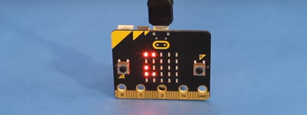

This project is related to mine because it shows directly how the temperature function in the Micro Bit works.

### Related project 2 ###
Max-min thermometer

https://microbit.org/projects/make-it-code-it/max-min-thermometer/

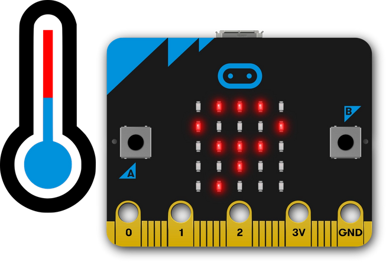

This project is related to mine because it shows how to use the temperature feature in practical and useful ways + reinforces the uyse of temperature based variables.

### Related project 3 ###
Indoor Outdoor Thermometer

https://microbit.org/projects/make-it-code-it/indoor-outdoor-thermometer/

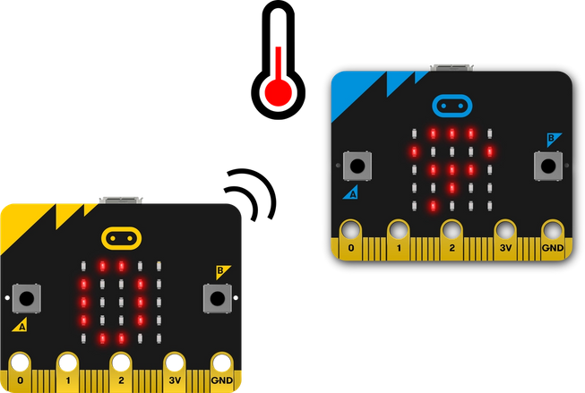

This project is related to mine because it uses one microbit to show multiple variables in different ways.

### Related project 4 ###
Micro Morse Phone

https://make.techwillsaveus.com/microbit/activities/micro-morse-phone

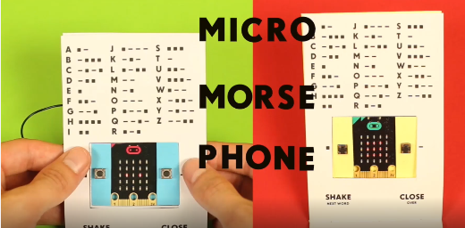

This project is related to mine because it gave me the overall idea for my project with micro bit + morse code.

### Related project 5 ###
Morse Code (On Screen)

https://makecode.microbit.org/courses/csintro/radio/activity

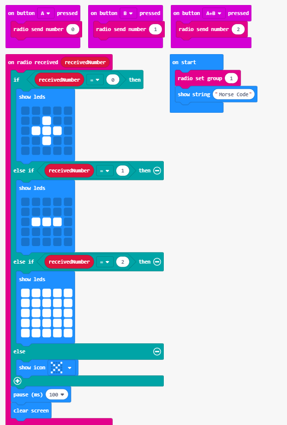

This project is related to mine because it showed how to show morse code on the screen of the micro bit - which I was using at the start of the process to prototype my idea.

### Related project 6 ###
Morse Code Beacon

https://microbit.hackster.io/snap-bit/snap-bit-morse-code-beacon-25fec3

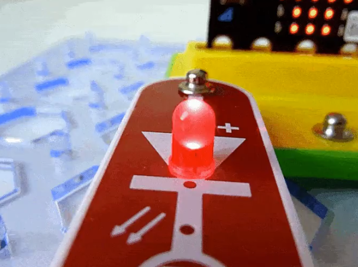

This project is related to mine because it shows how to translate morse code into a light pattern with the Micro Bit.

## Reading reflections ##

### Reading: Don Norman, The Design of Everyday Things, Chapter 1 (The Psychopathology of Everyday Things) ###

*What I thought before: Describe something that you thought or believed before you read the source that was challenged by the reading.*

I can't say that I've ever particularly thought about the 'experience' of something. The way Don Norman talks about the experience of using their favourite car made me rethink my previous thought.

*What I learned: Describe what you now know or believe as a result of the reading. Don't just describe the reading: write about what changed in YOUR knowledge.*

In particular what changed about my knowledge is that when designing a product, I'm going to have to think about what the product 'feels' like, not just the practicality of it. While this can be frustrating, it makes an interesting distinction between practicallity of an object and the emotional feelings that the product brings.

*What I would like to know more about: Describe or write a question about something that you would be interested in knowing more about.*

How does the emotional attachment to an object (i.e. a roomba) change the experience of it? Could you argue that a sentimental attachment is stronger than the pleasurable experience of using it?

*How this relates to the project I am working on: Describe the connection between the ideas in the reading and one of your current projects or how ideas in the reading could be used to improve your project.*

I'll really have to think about the experience that my product delivers! Is it frustrating, simple, fun? These questions are now important.

### Reading: Chapter 1 of Dan Saffer, Microinteractions: Designing with Details, Chapter 1 ###

*What I thought before: Describe something that you thought or believed before you read the source that was challenged by the reading.*

Well, I've absolutely NEVER thought about microinteractions for a start. So learning about them was definitely something new!

*What I learned: Describe what you now know or believe as a result of the reading. Don't just describe the reading: write about what changed in YOUR knowledge.*

That microinteractions are the small pieces of functionality around us, they're the things that we know are there but really never think too much about. They are intuitive and natural. By paying attention to them as a designer you can create A+ user experiences.

*What I would like to know more about: Describe or write a question about something that you would be interested in knowing more about.*

How far can you go? Is there a point where it just feels like too much for the user?

*How this relates to the project I am working on: Describe the connection between the ideas in the reading and one of your current projects or how ideas in the reading could be used to improve your project.*

Unfortunately this doesn't relate directly to my project, however it is deginitely an interesting reading. And the use of microinteractions can absolutely be used in further assessment.

### Reading: Scott Sullivan, Prototyping Interactive Objects ###

*What I thought before: Describe something that you thought or believed before you read the source that was challenged by the reading.*

Really, I had the same thought process as Scott Sullivan. My father is a programmer, so I've always found these sorts of things interesting but also very intimidating! Hearing the same story from another person solidified my belief that anyone can do this!

*What I learned: Describe what you now know or believe as a result of the reading. Don't just describe the reading: write about what changed in YOUR knowledge.*

By becoming familiar with physical prototyping, you also become more familiar with general product design. By using these prototypes you see what you need to change and what works!

*What I would like to know more about: Describe or write a question about something that you would be interested in knowing more about.*

Could you use a prototype not as an actual prototype, but as a way to gather information? Sort of a pre-prototype. I.E. if you're making a wearable device, wear a prototype version to understand exactly what you need.

*How this relates to the project I am working on: Describe the connection between the ideas in the reading and one of your current projects or how ideas in the reading could be used to improve your project.*

Prototyping my design will be imperetive to its final outcome, by prototyping several times, it can end up being a much better final product!

## Interaction flowchart ##

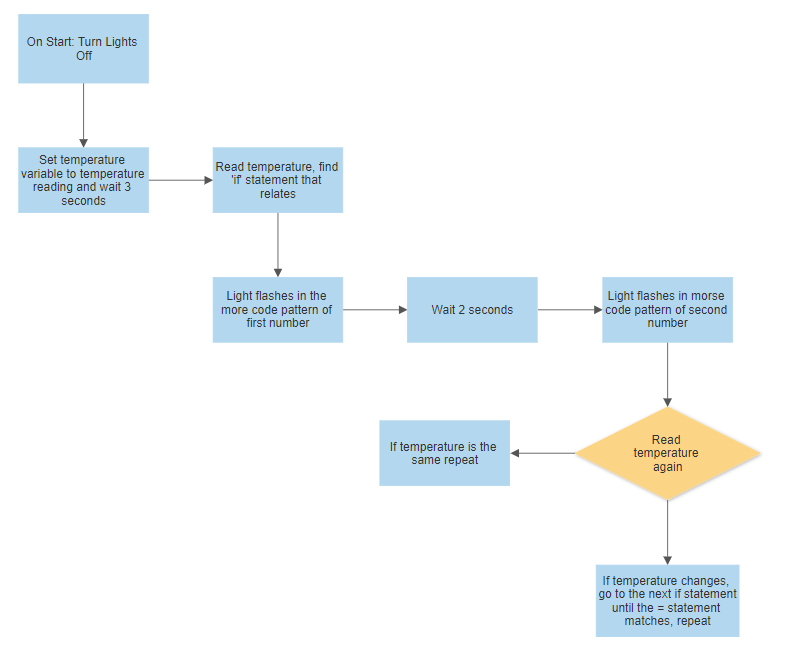

## Process documentation

Starting with the general idea, I knew that I wanted to have the temperature display on the screen. I tested how this would work first by making it appear on the screen of my microbit in the simulator like this: 

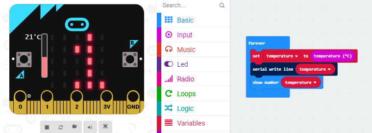

This was now displaying the temperature of the microbit on the simulator, I imported this code onto the physical microbit by pairing it to my device and having them connected. Through testing I found that the micro bits temperature never went below 28 degrees, and higher than 35. This gave me my baseline for the temperatures I would be using for the remainder of the project.

I then continued with the project, following the tutorial on microbit, I managed to have the microbit display the temperature on the display abnd (instead of using a servo motor to turn a gauge, as I lacked these materials) I had it turn on a green light when it was below 30 degrees, a yellow light when it was above 30 but below 34 + a fan, and a red light + the fan continues when its over 35. Unfortunately the code for this was lost, however, photos and videos of the project can be found below:

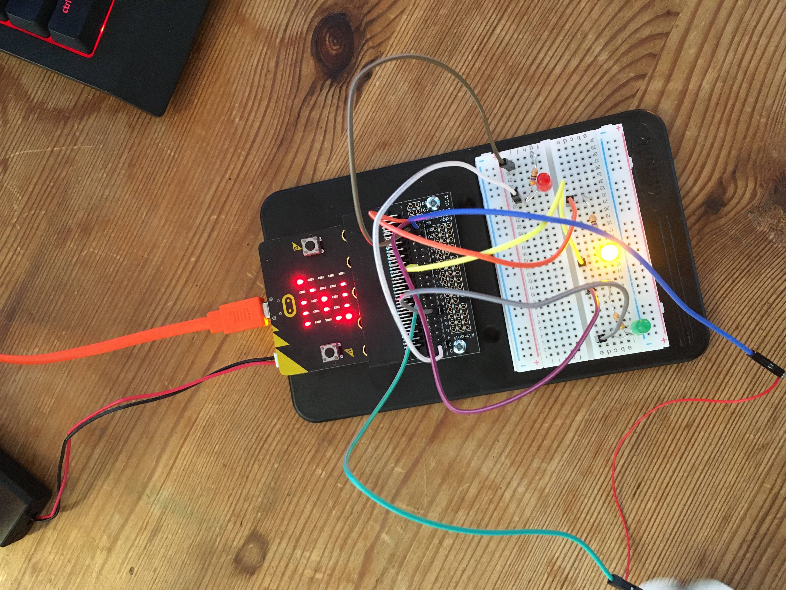

Video of it working: https://photos.app.goo.gl/e9KHD2anZB9oBSSZ6

This is the point where I wanted to start making the project my own. I felt I had a solid understanding of the code + microbit as well as how the microbits temperature gauge worked. So I set out to make my own temperature gauge project.

My immediate plan was to have the microbit display the temperature in an impractical manner, mostly because I think it would be a challenge + make for an interesting final product. This is how I settled on showing the temperature in morse code. I had the lights + the coding knowledge to pull it off, so I set right off!

Now I started writing the code - I found that I could do it one of two ways. The short way or the long way. The short way looked like this (this is the code from related project 6 that I brought across): 

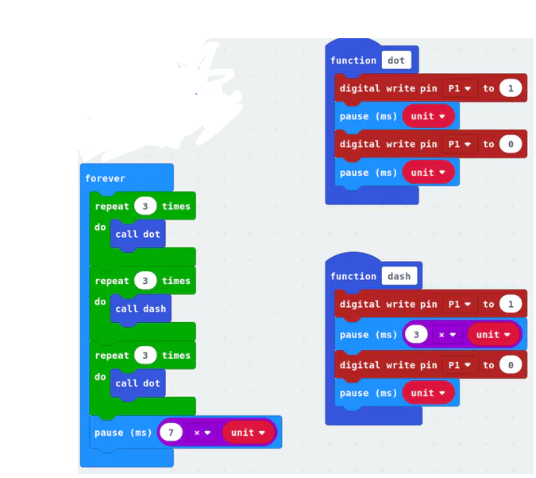

While this works - I wanted to have more individual control over the pauses between the dots and lines that the code produces. So I ended up making my own (much longer) version. Which looks like this:

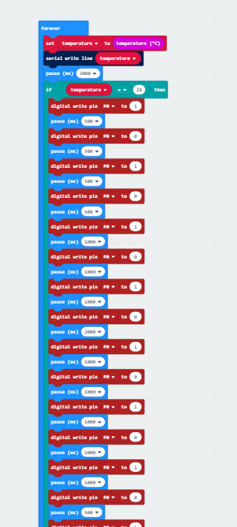

This code is so long that I can't fit even half of it into the screenshot. The reason I made the code this way, is that if something goes wrong I can change every minor detail, rather than trying to fix an overlying issue. I made sure to write all the pins to P0 (as this is where my light will go) and found that 500 ms gaps makes effective dots, and a 1000 ms gap makes good lines. There is also a 2000 ms gap between the two numbers. Once the two numbers are displayed in morse, a 3000 ms gap is placed to breakup the timing and allows the viewer to mentally 'reset'. For an idea of how long this code is, here is the code fully zoomed out, in multiple screenshots:

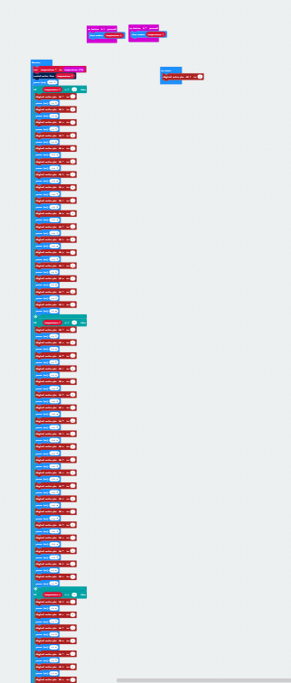

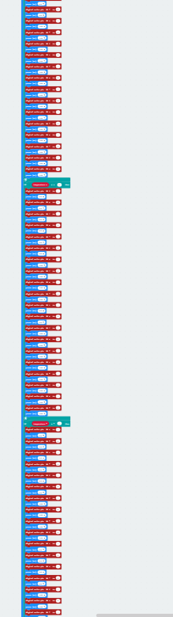

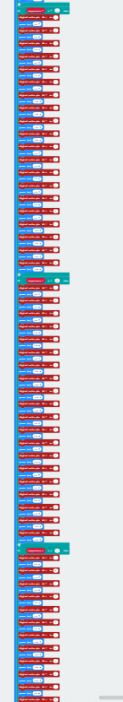

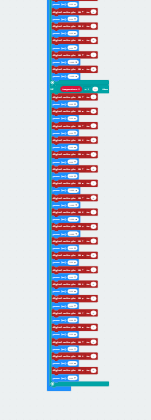

## You can also find the code at this link, as that'll be much easier to view: ##

https://github.com/QCAFrankBlokdijk/1701QCA-Assessment1/blob/master/replicationproject/microbit-Temperature-Gauge.hex

I also added a failsafe to check the temperature is working correctly, by pressing any of the two buttons on the microbit, the microbit itself shows the temperature on the screen. As well as this, in the code I added an on start check that makes sure the light is turned off. This is to ensure no false readings. The main section of this code can be found below:

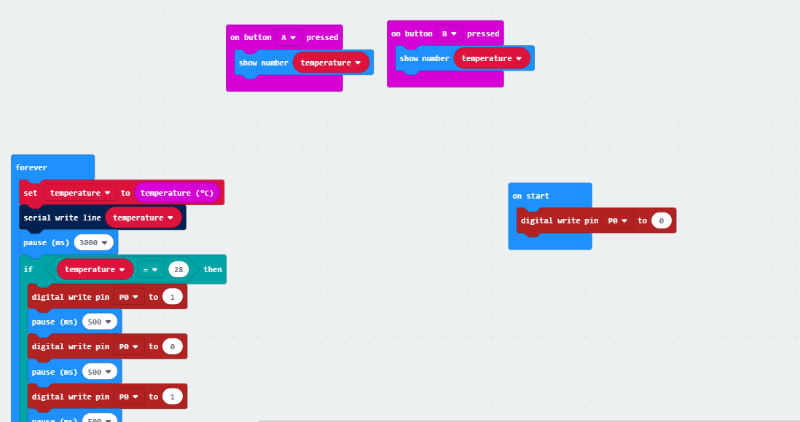

Now that the code is all finished, I just had to build it on the microbit. For all intents and purposes the wiring of this is very simple. A single red light, the positive going the Pin 0, the negative going through a resistor to the ground. Simple as that. The final product of the wiring can be seen here:

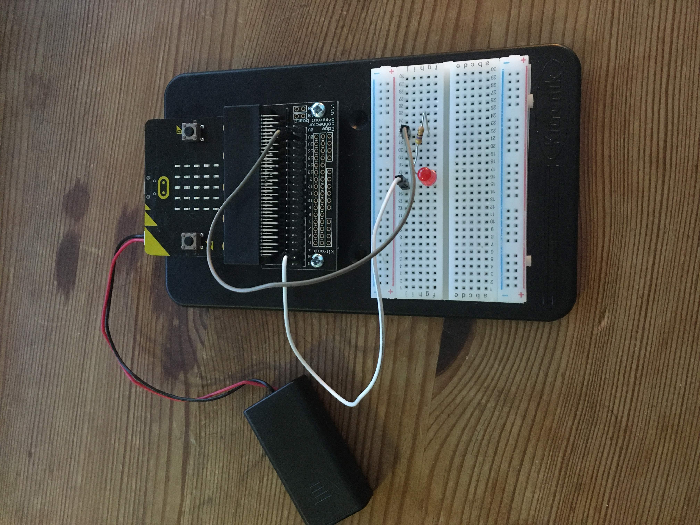

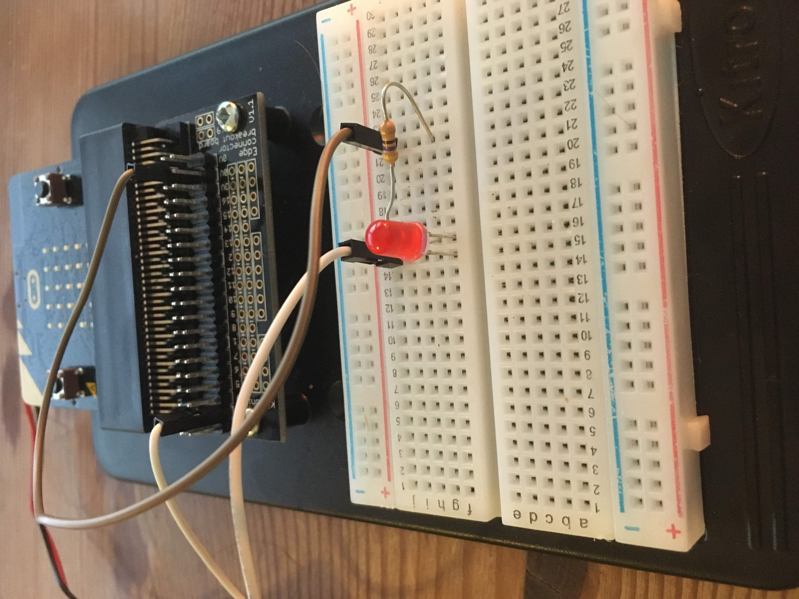

I then tested the code on the micro bit, and hooray! It worked! Here's the link to the video of working:

https://photos.app.goo.gl/gBSL7Wpch76fmNBM9

Now that I know the code works, I had to start thinking about how I was going to package it. Not only do I have to think about the fact that the whole microbit + light has to fit into the final object, I also have to think about the fact that the final product will have to have a morse code sheet on it! Mostly because I think its fair to assume that most people in 2020 don't know morse code. So, I found a cardboard box, made it a whole bunch smaller and popped it in there with a hole in the top to see the light! See the project outcome for the final result!

## Project outcome ##

### Morse Cold ###

### Project description ###

Morse Cold is an interactive temperature gauge, that shows the current temperature in the most impractical way possible! Morse Code (Or Cold - get it!) This product, at its core, is a toy. More specifically a desk toy, the simplicity of its design and code means that it can be sold for dirt cheap as a silly toy for a persons desk.

### Showcase image ###

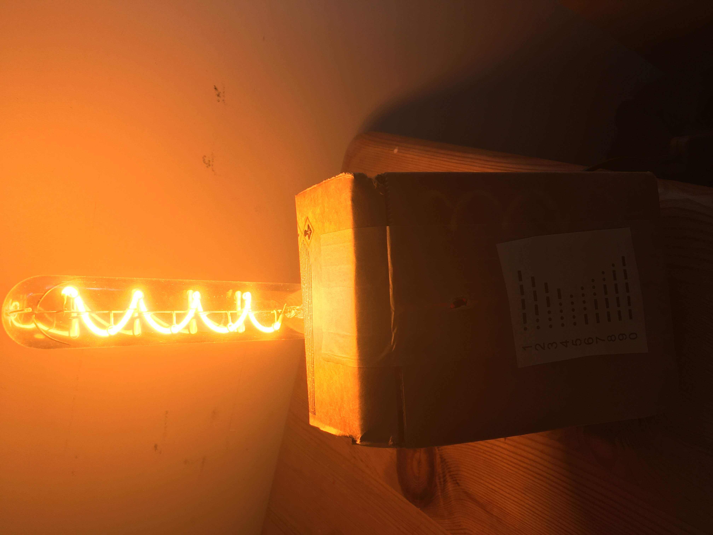

### Additional view ###

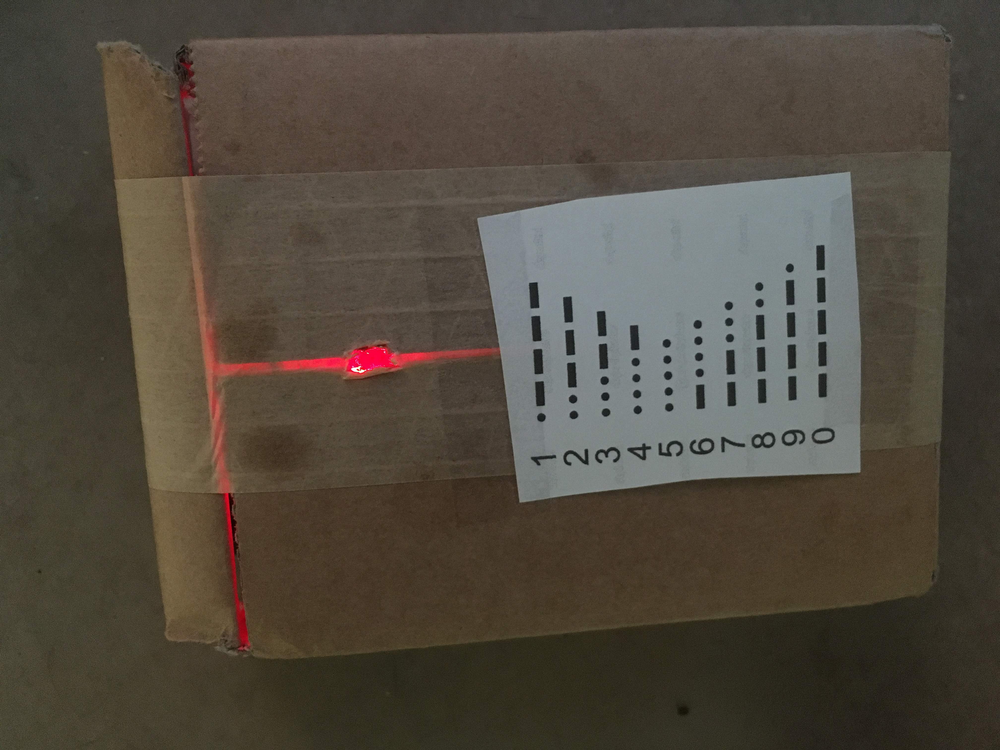

### Reflection ###

I felt that my code was very successful, while rather clunky and long winded I feel that it did its job well. I feel like my product design could have been better, while I had ideas for better final products I was ultimately limited in my work without access to the resources that the university provides.

The techniques presented in the related projects I found were invaluable in finishing my final product. Without the rudimentary code of the morse code beacon I wouldn't have had the idea in the first place to make the code longer and more precise. The approach that project and those of the official micro bit site were also remarkably helpful in making my final product. As they were easy to follow and understand.

An interesting extension of this project would be to add multiple lights, have a light that indicates the stop of a word or breaks between numbers. This would be a nice extension and would also not be too challenging to implement. This project specifically could also be used for large scale, far away temperature metres. For example, in the same way that a lighthouse guides boats, it could be used to identify the temperature of the surrounding water for fisherman.

Ultimately I'm rather happy with how my final product came out, regardless of the limitations put in place by limited access to the university, I still find my project endearing. The cardboard aesthetic of the box lends itself well to the contents, and adds to the 'funny' aspect of the impracticality of the final product.
